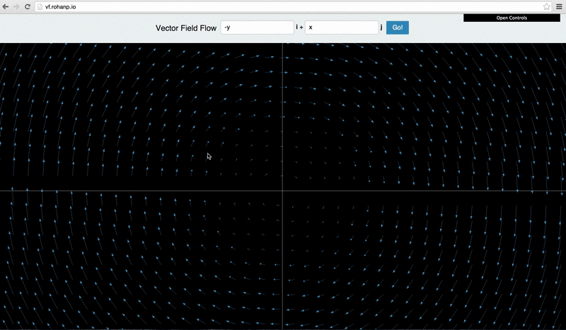
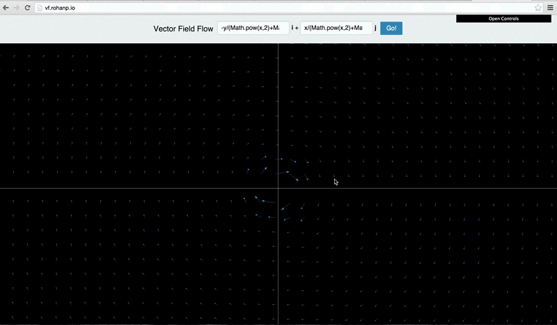
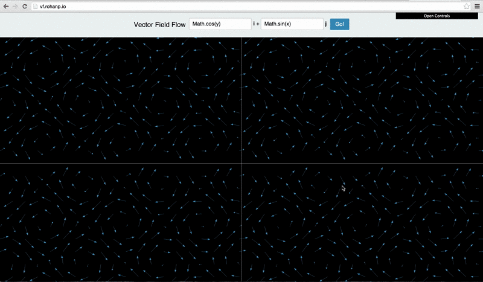

VectorFieldFlow
===============

This interactive app shows the flow of vector fields and can be used to illustrate the concepts and significance of curl and divergence, which are usually explained in some abstract mathematical manner.

Divergent vector fields cause the blob change in area, while
vector fields with non-zero curl cause the blob to circulate about the origin.

Plotting interesting vector fields can create mesmerizing visualizations.

-y/(x 2 + y 2) <b>i</b> + x/(x 2 + y 2) <b>j</b>

 cos(y) <b>i</b> + sin(x) <b>j</b> 

